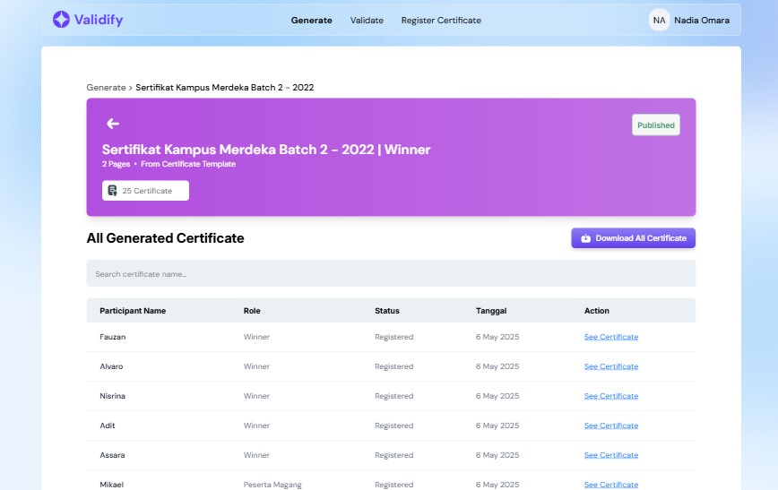

<br />
<div align="center">
  <a href="https://github.com/Nafidinara/creditopia">
    
  </a>
  <h3 align="center">Validify - Automated, Verifiable Certificates at Scale and Powered by AI & Blockchain</h3>
  <p align="center">
    Validify is a digital platform for fast, secure, and automated certificate creation and verification. With features like custom design uploads, Excel-based batch generation, OCR validation, and blockchain-powered storage via Internet Computer Protocol (ICP), Validify offers a modern solution for digital certification across industries.
    <br/>
    <br/>
    <a href="https://youtu.be/cXDXjghX4NU">View Demo</a>
    ·
    <a href="https://github.com/validify-icp/validify/issues">Report Bug</a>
    ·
    <a href="https://github.com/validify-icp/validify/issues">Request Feature</a>
  </p>
</div>

---

## 🚀 Why Validify?


### ✅ 1. Fast & Efficient

Generate certificates at scale with a single upload of Excel data and your own custom design.

### ✅ 2. Reliable Validation

Validate certificates using OCR technology without manual input or cross-checking.

### ✅ 3. Secure & Transparent

All data is stored on the ICP blockchain to ensure authenticity and prevent tampering.

### ✅ 4. User-Friendly

Simple interface for creating, managing, and verifying digital certificates with ease.

---

## 🔑 Key Features

- 🎨 Upload your own background designs
- 📦 Bulk generation via Excel template
- 🔍 OCR-powered certificate validation
- 🔐 Immutable storage via ICP blockchain
- 📄 Unique QR code on every certificate
- 📊 Admin dashboard for monitoring and logs

## 🧑‍💻 Technologies Used

- **Internet Computer Protocol (ICP)**
- **Motoko** for smart contract development
- **React Typescript** for frontend interface
- **Tesseract** for AI certificate scanning & validation

## 🏆 What We’re Proud Of

- Successfully integrated OCR technology for certificate validation
- Seamless batch certificate generation with real-time blockchain recording
- Built a user-friendly interface for non-technical users to create digital certificates
- Deployed a decentralized validation system using Internet Computer Protocol (ICP)

## ⚡ The Superpowers of Internet Computer (ICP)

- 🔧 Easy debugging and fast iteration using Motoko
- 🔐 Immutable and decentralized data storage for secure certification
- ⚙️ Simple deployment and integration with modern front-end stacks (React.ts)
- 🤝 Backed by a helpful and active developer community
- 💸 Extremely low deployment and maintenance costs compared to traditional servers

## Getting Started

1. Clone the repository:
   ```sh
   git clone https://github.com/validify-icp/validify.git .
   ```
2. Go To INSTALLATION.MD:
   Follow all the instruction on the INSTALLATION.MD file

## Demo App

| Verify Landing Page                        | Register Events                               |
| ------------------------------------------ | --------------------------------------------- |
|  |  |

| Preview Certificate                               | Upload Own Background                        |
| ------------------------------------------------- | -------------------------------------------- |
|  |  |

| Participants Completion                       |
| --------------------------------------------- |
|  |

| Preview Participants                               | Preview Participants Error                                |
| -------------------------------------------------- | --------------------------------------------------------- |
|  |  |

| List Result Certificate                                | Certificate Image                               |
| ------------------------------------------------------ | ----------------------------------------------- |
|  |  |

| Validate Page                               | Validate Result                                |
| ------------------------------------------- | ---------------------------------------------- |
|  |  |

## License

Distributed under the MIT License. See `LICENSE.txt` for more information.

## Created by VictoryAndFortune Team

- Daniel Alvaro Sormin (Developer)
- Fauzan Ali Vijsma (Developer)
- Nisrina Thifal Khairunnisa (UI/UX Designer)
- Aditama Putra (UI/UX Designer)
